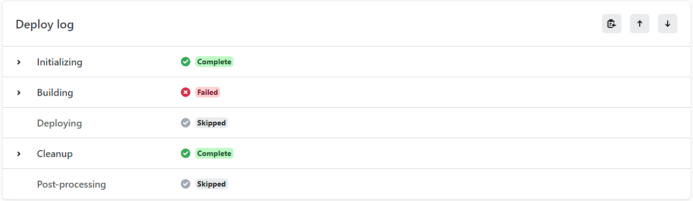
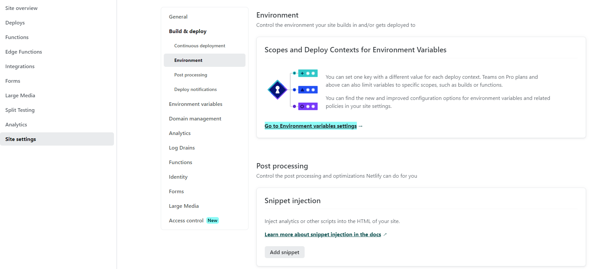
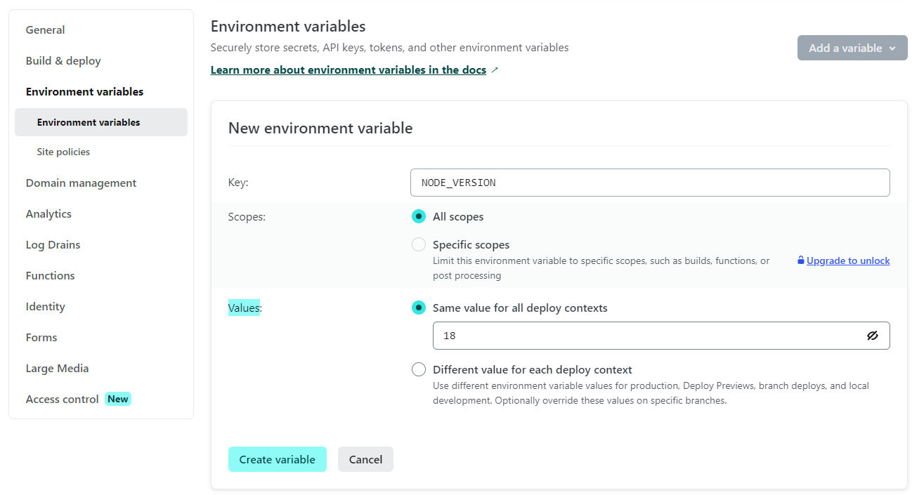

這兩天興致滿滿得建立好部落格後，打算找個雲端的環境來佈署自己的網站。對於一個新建立的部落格來說，沒甚麼特別的需求，一切就以方便、便宜作為優先考慮條件，在思考要佈署到甚麼平台上時，剛好看到 [Gatsby's blog starter](https://github.com/gatsbyjs/gatsby-starter-blog) 上推薦使用 [Netlify](https://app.netlify.com/signup) 來快速的佈署網站，免費方案就有提供 100 GB 的資料傳輸量，就決定來試用看看了。


在佈署的過程也不繁雜，大致也就三個步驟

1. 註冊帳號
2. 選擇要佈署的 Gatsby 專案(我放在 Github 上)
3. 點選 `Deploy` 開始佈署

都是跟著 UI 操作，沒有甚麼難度，就是佈署結果不成功而已



問題發生在 Building 這個環節，把 log 展開來看，
錯誤很清楚的顯示要建置 Gatsby 專案要求 Node.js v18.0.0 以上版本，但環境上的版本為 v16.20.0


```
9:18:54 PM: $ npm run build
9:18:54 PM: > gatsby-starter-blog@0.1.0 build
9:18:54 PM: > gatsby build
9:18:54 PM: error Gatsby requires Node.js 18.0.0 or higher (you have v16.20.0).
9:18:54 PM: Upgrade Node to the latest stable release: https://gatsby.dev/upgrading-node-js
```

再看一下 Initializing 步驟中，系統中預載的版本是 v16.20.0

```
9:18:09 PM: v16.20.0 is already installed.
9:18:09 PM: Now using node v16.20.0 (npm v8.19.4)
```

那麼查了一下網路上前輩的解決方式，降板是其中一種作法。不過有新版本可以用，我實在很不想去用舊的版本，不管是 Node 或是 Gatsby 都不想。後來又找到友人分享從環境變數設定 Node 版本的作法，試了一下確實有效，就決定來把這個方法給記錄下來。

先切換到要佈署的網站後，依照以下功能路徑選擇

`Site setting` > `Build & Deploy` > `Environment` > `Go to Environment variables settings`



接著點選 `Add a variable`，新增一個環境變數，再點選 `Create variable`

* `Key` 輸入 `NODE_VERSION`
* `Values` 輸入 `18`



最後再重新啟動佈署後就成功囉