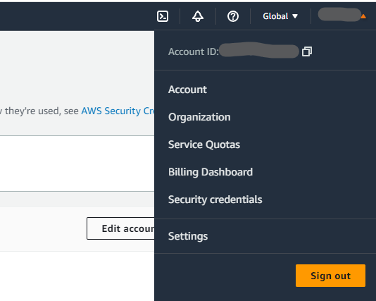
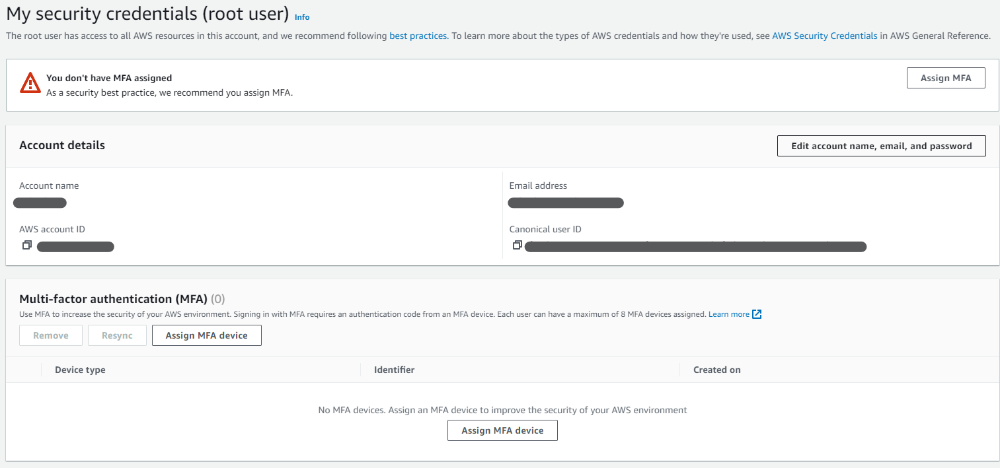
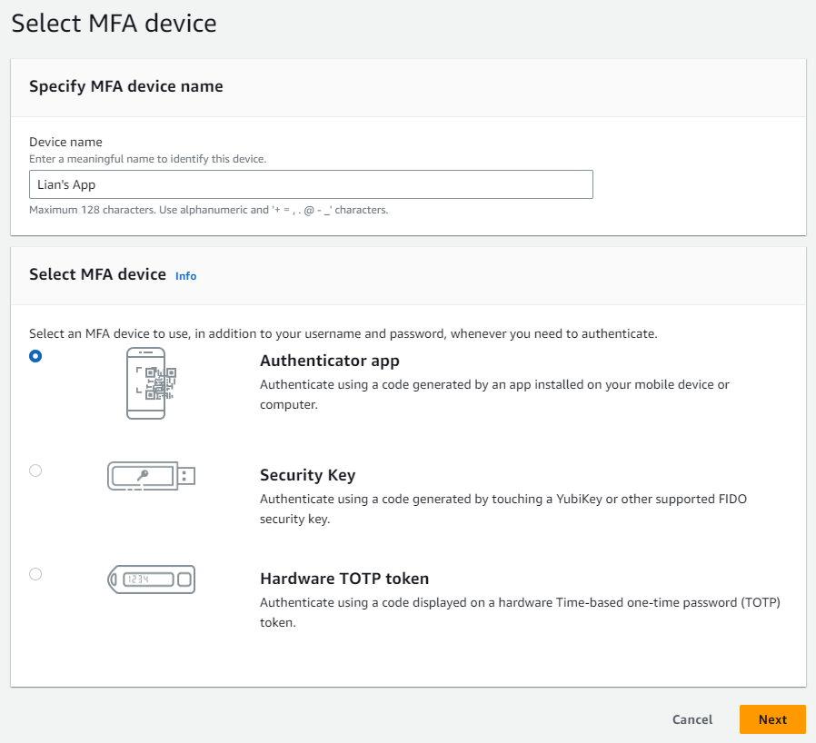
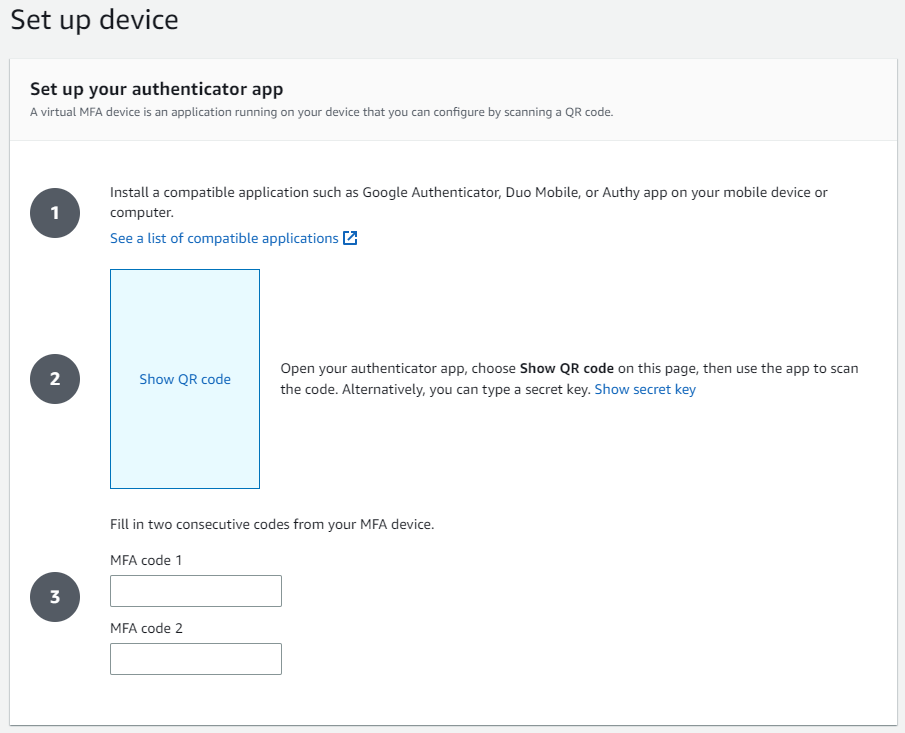

以前還是個小屁孩的時候很愛玩楓之谷，也就是當時解鎖了曾被盜帳號的成就。當時偷買點數卡變賣楓幣好不容易存夠錢買的一組日標，隔天登入帳號就不見了，當時的難過難以言喻。後來我就去買了一張 Playsafe 晶片卡，在登入前，都必須將卡片插入讀卡機，驗證過之後才能登入遊戲。現在想想，那應該也算是一種 MFA 了吧。

多因素身份驗證（MFA）為身分驗證機制提供了一曾額外的保護，可以幫助防止未經授權的訪問和數據洩露。如果是 AWS 帳戶資訊被有心人士竊取，險就不再只是遊戲帳戶被盜那麼單純，作者大概整理了以下幾種帳號被竊取後可能發生的狀況：

* **數據洩露**：帳戶被劫持後，攻擊者可以訪問 AWS 中儲存的任何數據。這可能包括敏感信息，如用戶數據，財務信息，或企業機密
* **資源濫用**：攻擊者可能會利用 AWS 資源來進行不法活動，如發動 DDoS 攻擊，挖礦加密貨幣等。這可能會導致**巨大的財務損失**，並可能導致 AWS 帳戶被暫停。
* **服務中斷**：攻擊者可能會刪除或修改 AWS 資源，如 EC2 、 S3 等。這可能會導致運作中的服務中斷，並需要花費大量的時間和金錢來恢復，也可能影響服務使用者對服務安全性的信心。

因此，設置 MFA 對於保護 AWS 帳戶和降低上述風險相當重要。透過需要第二種身份驗證方法，即使密碼洩漏，帳戶仍然有額外的保護層。要在 AWS 帳戶上設置 MFA 非常的簡單，依照以下的幾個步驟來操作就可以完成設定：

1. 登入 AWS Management Console 進入主控台頁面

2. 點選右上角 `帳戶選單` >> 從展開的選單中點選 `Security credentials`

3. 找到 `Multi-factor authentication (MFA)` 區塊 >> 點選 `Assign MFA Device` 進入 MFA 設定頁面

4. 在 `Divice name` 欄位輸入自己 MFA 設備的名稱 >> `Select MFA device` 選擇 `Authenticator app` >> 點選 `Next`

5. 使用 Authenticator App 掃描 QR Code 後，輸入 App 上顯示的連續兩組驗證碼
(作者用過 Microsoft Authenticator 、 Google Authenticator 都可以成功設置)

6. 設定完成。下次需要登入時， AWS 將會要求您輸入 Authenticator App 上顯示的驗證碼

如此一來，帳號就多了一層保護，從此之後可以更安心的睡覺了